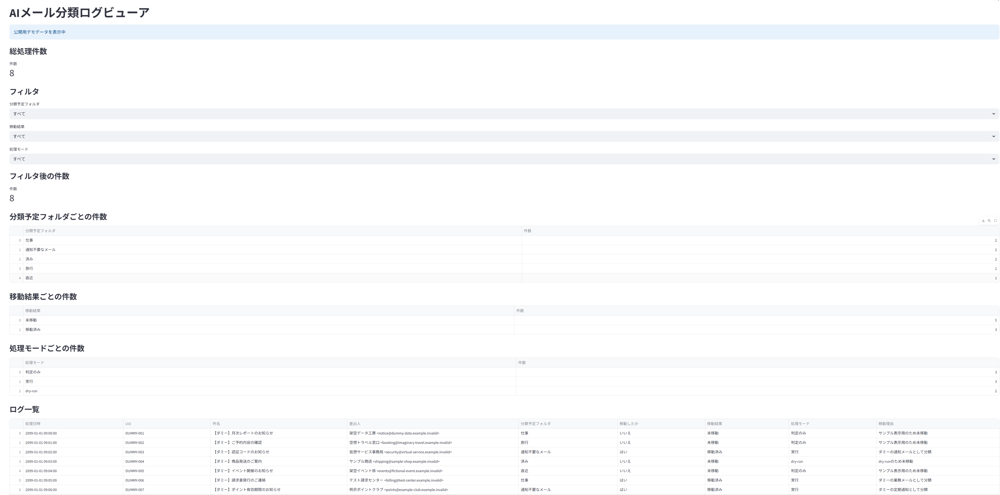

# AI Mail Ops Assistant

AI Mail Ops Assistant は、メールを IMAP で取得し、OpenAI API で内容を分類・要約し、処理結果を CSV に証跡として残す業務支援ツールです。
金融系 SE としてのメール確認、障害連絡、ベンダー連絡、ログ確認、報告作業の経験をもとに、「AI に判断を任せきりにせず、人間が確認できる形で業務を補助する」ことを重視して作成しています。

このリポジトリでは、実メール・個人情報・API キーは公開せず、ダミーデータやサンプルログで動作イメージを説明します。

## 画面イメージ



AIの分類結果を、件数集計・フィルタ・一覧表示で確認できます。公開用画面では完全なダミーデータを使用しています。

## 概要

主な処理は以下の流れです。

1. IMAP でメールを取得する
2. 件名、差出人、本文を抽出する
3. OpenAI API でメールを分類・要約する
4. 分類結果から移動予定フォルダを判断する
5. `DRY_RUN` により実移動を抑止しながら安全に確認する
6. 処理結果を `mail_sort_log_v3.csv` に記録する
7. Streamlit Mail Log Viewer で CSV ログを確認する

現時点では、安全確認を優先し、`DRY_RUN=True` を前提にしています。AI の判断結果をすぐに本番反映するのではなく、CSV ログと画面で人間が確認できる設計です。

## 背景と解決したい課題

金融系 SE の業務では、障害連絡、ベンダーからの確認依頼、銀行・顧客関連の通知、定型的なメール、不要な通知など、多くの情報がメールで届きます。

メール件数が増えると、以下のような課題が発生します。

- 重要な連絡と不要な通知を素早く分けにくい
- 障害・ベンダー連絡・業務通知の初動確認に時間がかかる
- メール処理の判断理由が後から追いにくい
- AI の分類結果をそのまま実行すると誤分類時のリスクがある
- 実メールや個人情報を扱うツールは、転職活動用のポートフォリオとして公開しにくい

このツールでは、AI による分類・要約を活用しつつ、`DRY_RUN`、CSV 証跡、人間確認を組み合わせることで、安全に説明できる業務自動化の形を目指しています。

## 主な機能

- IMAP によるメール取得
- UID を使ったメール取得
- MIME メールの件名・差出人・本文抽出
- `iso-2022-jp` など日本語メールを想定した本文デコード
- OpenAI API によるメール分類・要約
- AI 回答から分類予定フォルダを抽出
- Yahoo メール上のフォルダ存在確認
- `DRY_RUN=True` による実移動の抑止
- CSV ログへの処理結果保存
- 1 件の処理でエラーが起きても後続メールへ進む例外処理
- Streamlit によるログ閲覧・集計・フィルタ表示

## 使用技術

### アプリケーション / AI

- Python 3.12
- OpenAI API
- IMAP / `imaplib`
- MIME 解析 / `email`
- IMAP UTF-7 / `imapclient`
- pandas
- Streamlit
- python-dotenv

### テスト / DevOps

- pytest
- Docker
- Git / GitHub
- GitHub Actions

### 開発支援

- VS Code
- Codex

`requirements.txt` には実行時依存を、`requirements-dev.txt` にはテスト用依存を定義しています。

## 処理フロー

```text
メールボックス
  ↓
IMAP 接続
  ↓
既読メール UID の取得
  ↓
メール本文・件名・差出人の抽出
  ↓
OpenAI API で分類・要約
  ↓
分類予定フォルダの抽出
  ↓
DRY_RUN 判定
  ↓
実移動せず CSV に記録
  ↓
Streamlit Mail Log Viewer で確認
```

分類結果は、たとえば以下のような観点で整理する想定です。

- 転職関連
- 投資関連
- 旅行関連
- 銀行関連
- 会社関連
- 通知不要なメール

実際の分類名は、コード内のプロンプトやメールフォルダ設計に合わせて調整できます。

## 安全設計

### DRY_RUN

`mail_classifier.py` では `DRY_RUN = True` を設定しています。
この状態では、AI が「移動対象」と判断しても、実際のメール移動は行わず、処理結果をログに残します。

これにより、以下を事前に確認できます。

- AI の分類結果が妥当か
- 移動予定フォルダが想定どおりか
- 誤分類が発生していないか
- CSV ログに必要な証跡が残っているか

### CSV 証跡

処理結果は `mail_sort_log_v3.csv` に記録されます。

主な項目は以下です。

| 項目 | 内容 |
| --- | --- |
| 処理日時 | メールを処理した日時 |
| UID | IMAP 上のメール UID |
| 件名 | メール件名 |
| 差出人 | メール差出人 |
| 分類予定フォルダ | AI が判断した分類先 |
| 移動したか | 実際に移動したか |
| 移動結果 | `dry-run`、未移動、エラーなど |
| 処理モード | `dry-run`、判定のみ、エラーなど |
| 移動理由 | 移動・未移動の理由 |

CSV に残すことで、AI の判断を後から確認できます。これは、金融系や業務システムで重視される「証跡を残す」「後から説明できる」考え方に合わせています。

### 人間確認

このツールは、AI の判断をそのまま本番反映する設計ではありません。
まず CSV と Streamlit 画面で人間が分類結果を確認し、必要に応じてルールやプロンプトを改善する前提です。

重要なメール処理では、以下のような運用を想定しています。

- 初期運用は `DRY_RUN=True` のまま確認する
- 誤分類がないかログで確認する
- 重要メールは人間が最終確認する
- 実移動を有効化する場合も対象フォルダや条件を限定する

## Streamlit Mail Log Viewer

`streamlit_app.py` は、AI 分類ログを画面で確認するためのビューアです。`mail_sort_log_v3.csv` が存在する場合はローカル実行ログを読み込み、存在しない場合は `sample_mail_sort_log.csv` を公開用デモデータとして表示します。

できること:

- 総処理件数の表示
- フィルタ後の件数表示
- 分類予定フォルダごとの件数集計
- 移動結果ごとの件数集計
- 処理モードごとの件数集計
- CSV ログ一覧の表示
- 分類予定フォルダ、移動結果、処理モードによるフィルタ

AI の分類結果を画面で確認できるため、Human-in-the-loop の運用に向いています。

## 実行方法

### 1. 開発用依存ライブラリをインストール

```bash
pip install -r requirements-dev.txt
```

### 2. テストを実行

```bash
pytest -q -p no:cacheprovider
```

### 3. `.env` を作成

`.env.example` を参考に、ローカル環境だけで `.env` を作成します。

```env
OPENAI_API_KEY=your_openai_api_key
YAHOO_MAIL_ADDRESS=your_mail_address
YAHOO_APP_PASSWORD=your_app_password
```

`.env` には実際の API キーやメール認証情報を入れるため、GitHub には公開しません。

### 4. メール分類処理を実行

```bash
python mail_classifier.py
```

現在は `DRY_RUN=True` を前提にしています。実メールの移動を行わず、分類結果を CSV に記録して確認します。

### 5. Streamlit Mail Log Viewer を起動

```bash
streamlit run streamlit_app.py
```

ブラウザで Streamlit 画面を開きます。`mail_sort_log_v3.csv` があればローカル実行ログが表示され、なければ `sample_mail_sort_log.csv` の公開用デモデータが表示されます。

### 6. Docker で実行

```bash
docker build -t ai-mail-ops-assistant .
docker run --rm -p 8501:8501 ai-mail-ops-assistant
```

Docker イメージには実ログを含めないため、Docker 実行時は `sample_mail_sort_log.csv` が表示されます。

## GitHub Actions

push 時に、GitHub Actions で Python 3.12 環境の `pytest` と Docker build を自動確認しています。

## `.env.example` の説明

このリポジトリでは、実際の `.env` は公開対象にしません。代わりに、必要な環境変数名だけを `.env.example` として用意しています。

| 変数名 | 説明 |
| --- | --- |
| `OPENAI_API_KEY` | OpenAI API を呼び出すための API キー |
| `YAHOO_MAIL_ADDRESS` | IMAP 接続に使用するメールアドレス |
| `YAHOO_APP_PASSWORD` | メールサービスのアプリパスワード |

注意点:

- API キーは GitHub に載せない
- メールアドレスやアプリパスワードは GitHub に載せない
- `.env` はローカル環境だけで管理する
- 公開用には `.env.example` のみを置く

## ダミーデータ利用方針

この公開リポジトリでは、実メール、実ログ、個人情報、社内情報、API キーを公開しません。
公開用データは完全なダミーデータのみを使用します。

公開時の方針:

- メール本文はダミーの文面を使用する
- 差出人は `sample@example.invalid` のようなサンプル値を使用する
- 公開用 CSV は完全なダミーデータのみを使用する
- 実際の顧客名、会社名、口座情報、障害内容、問い合わせ内容は載せない
- スクリーンショットを載せる場合も、個人情報や実メールが写っていないことを確認する

ダミーメール例:

```text
件名: 【サンプル障害連絡】ファイル連携処理でエラーが発生しました
差出人: sample-vendor@example.invalid

本日 09:15 頃、ファイル連携処理でタイムアウトエラーが発生しました。
現在、原因を調査中です。影響範囲は一部の送信処理です。
```

## 今後の改善予定

- README に Streamlit のスクリーンショットを追加する
- テストを拡充する
- メール分類ロジックを関数単位に整理する
- 分類ルール・プロンプトを外部設定化する
- FastAPI 化する
- LangGraph による Human-in-the-loop 化
- Amazon Bedrock へ切り替え可能な LLM 層を検討する
- HULFT / WebConnect ログ要約へ派生させる

## 金融系 SE 経験とのつながり

このツールは、金融系 SE としての以下の経験をもとにしています。

- 障害連絡メールの確認
- ベンダー問い合わせや調査依頼の整理
- 銀行・顧客関連の通知確認
- ログ確認や報告作業
- HULFT / WebConnect などの連携処理を意識した運用
- 重要な処理では証跡や確認手順を残す考え方

単なる AI チャットではなく、実務で発生する「メールを読み、分類し、判断理由を残し、人間が確認する」という流れを小さく再現しています。

## このプロジェクトで示せること

以下は、このプロジェクトで実装・確認できる技術要素です。

- 金融系 IT の現場課題を題材に、AI を用いたメール業務支援を設計している
- Python でメール取得・分類・記録の業務処理を実装している
- OpenAI API を利用したメールの分類・要約処理を実装している
- IMAP / MIME / UID を扱うメール処理を実装している
- CSV ログに処理結果を記録し、証跡を残している
- Streamlit で分類ログの集計・フィルタ・一覧表示を実装している
- `DRY_RUN` と人間による確認を組み合わせ、実移動を抑止できる安全設計としている
- 公開用デモを完全なダミーデータで構成し、実メールや認証情報を含めずに Streamlit ビューアの動作を確認できる
- `pytest` による自動テストを実行できる
- Docker により Streamlit ビューアの実行環境を再現できる
- GitHub Actions により、push 時に Python 3.12 での `pytest` と Docker build を自動確認している

実務上の制約、安全性、説明責任を意識した設計を、実装とテストを通じて確認できます。
